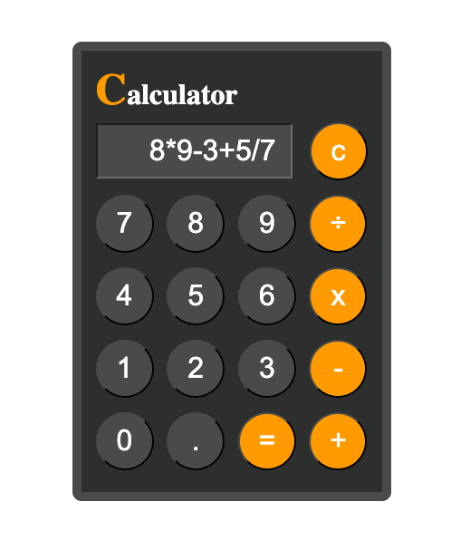
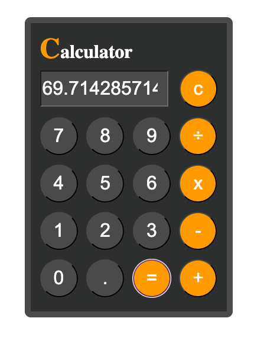

# Simple Calculator

🚀 [Live Demo](https://nanachiki.github.io/Simple-Calculator/)

A simple web-based calculator application built with HTML, CSS, and JavaScript.

## Features

- Perform basic arithmetic operations: addition, subtraction, multiplication, and division.
- Clear the input field with a single button.
- Responsive and visually appealing design.

## File Structure

- `index.html`: The main HTML file that defines the structure of the calculator.
- `style.css`: The CSS file that styles the calculator, including colors, fonts, and layout.
- `script.js`: The JavaScript file that handles the calculator's functionality.

## How to Use

1. Open `index.html` in a web browser.
2. Use the buttons to input numbers and operators.
3. Click the `=` button to calculate the result.
4. Press the `C` button to clear the input field.

## Preview

Here are some screenshots of the Simple Calculator in action.




## Code Highlights

### HTML
The calculator layout is defined in [index.html](index.html). For example:
```html
<div class='btns'>
  <input type='text' id='result'/>
  <input type='button' class='btn orange-btn' value='c' onclick='clearResult()'/>
</div>
```

### CSS
The styling is handled in [style.css](style.css), using CSS variables for easy customization: 
```css
:root {
  --color-orange: #ffa500;
  --color-white: #fff;
  --color-darkgray: #545454;
  --color-lightgray: #A6A6A6;
  --color-black: #333636;

  --small: 0.5rem;
  --medium: 1rem;
  --big: 2rem;

  --btn-size: 4rem;

  --font-size: 2rem;
  --font-large: 3rem;
}
```

### JavaScript
The calculator's functionality is implemented in [script.js](script.js). For example, the [solve](script.js) function evaluates the expression and displays the result:
```javascript
function solve() {
  let formula = document.getElementById("result").value;
  document.getElementById("result").value = eval(formula);
} 
```

## Known Issue
- The app uses [eval()](https://developer.mozilla.org/en-US/docs/Web/JavaScript/Reference/Global_Objects/eval) for expression evaluation, which can pose security risks if the input is not sanitized. Use with caution.
